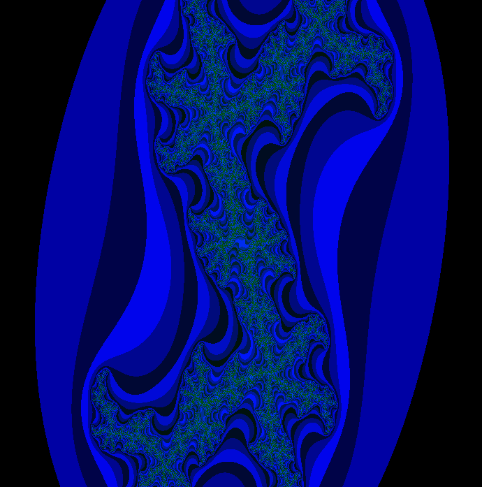
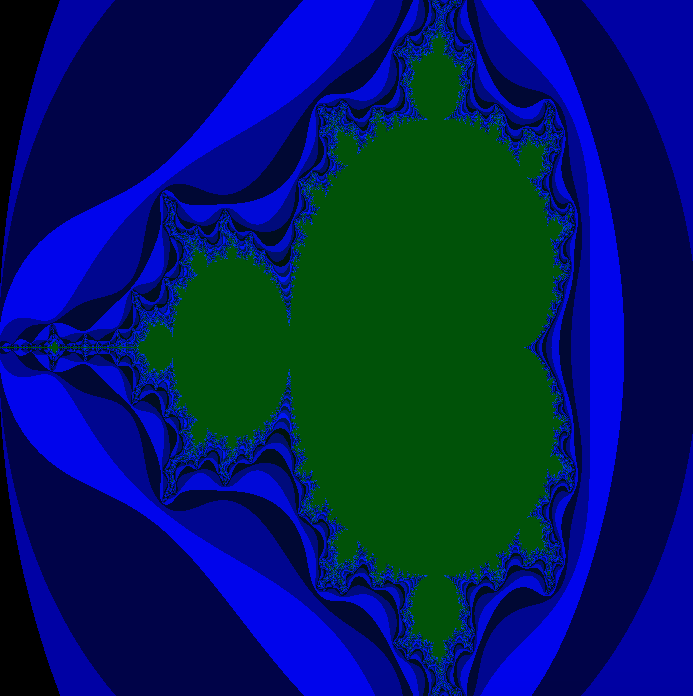
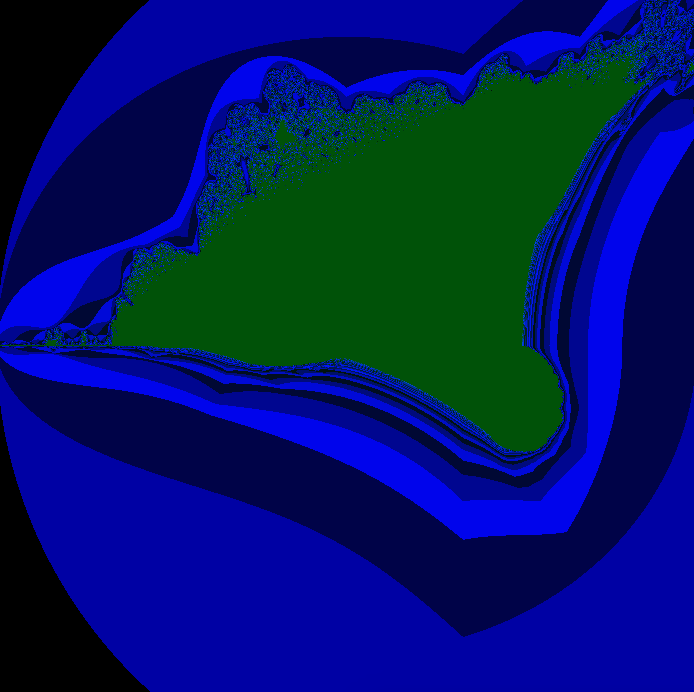

# Fract-ol
3e projet de la branche graphique du [cursus 42](https://www.42.fr).

## Description

Le Fract'ol génère des images dites "fractales" (images se répétant à l'infini).
Possibilité de zoom et de se déplacer. La fractale Julia suit les mouvements de souris.

## Usage

```
$> make
$> ./fractol Julia/Mandelbrot/Burning_Ship
```

## Exemples imagés

### Julia


### Mandelbrot


### Burning_Ship

